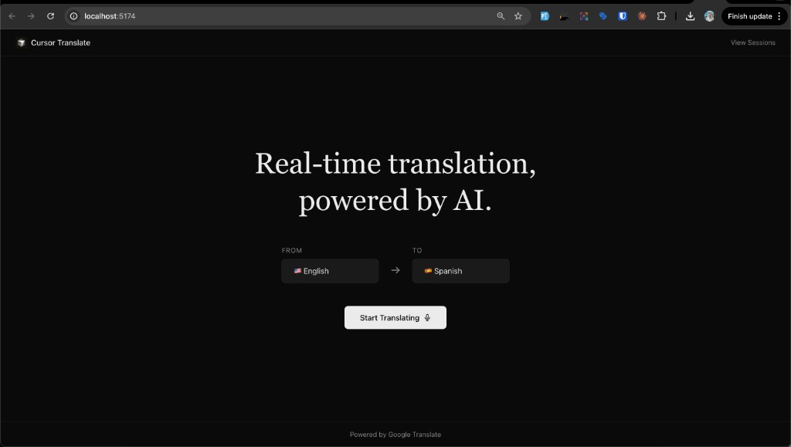
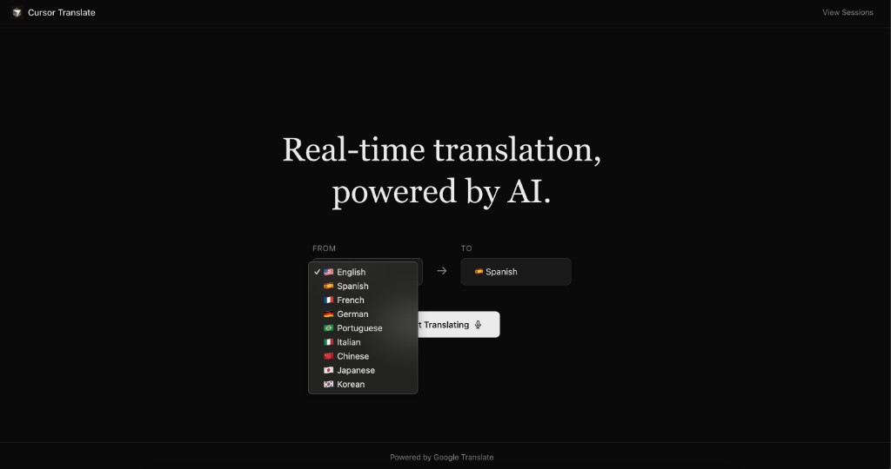
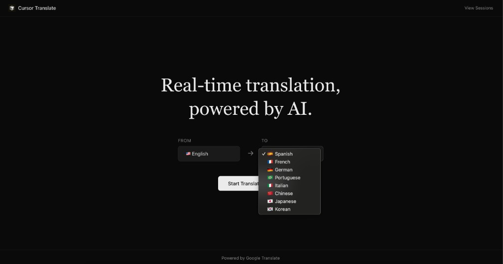
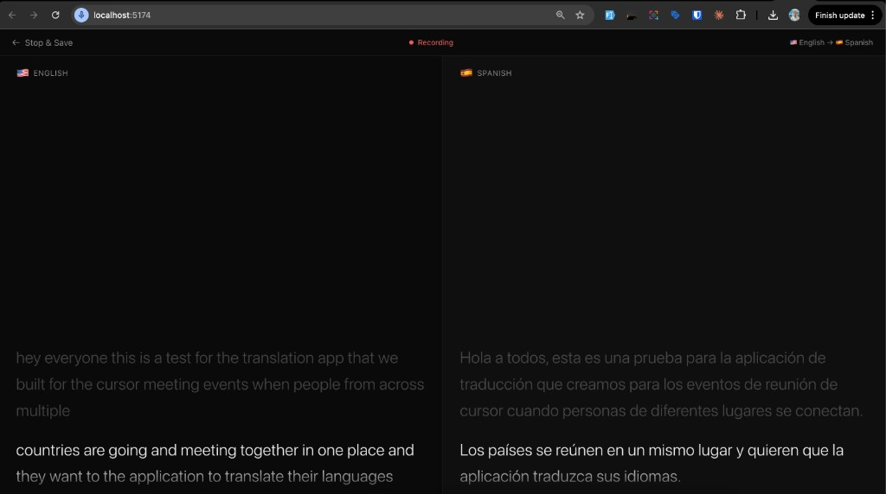
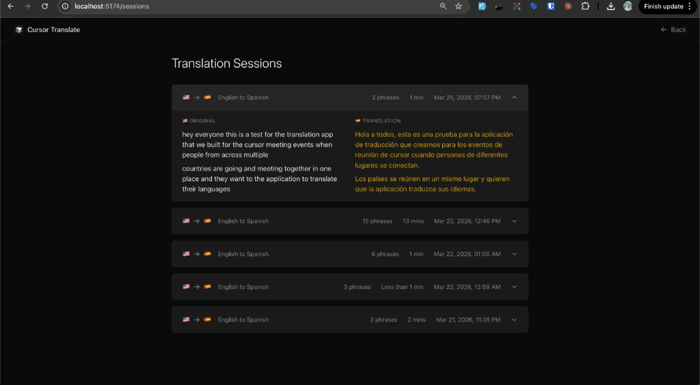

# Cursor Translate

A real-time speech translation app that captures spoken audio, transcribes it via the browser's Web Speech API, and instantly translates it using Google Cloud Translate — displayed in a live, side-by-side caption view.

## Screenshots



<details>
<summary>Language selection</summary>




</details>





## Features

- **Live speech recognition** — continuous transcription with interim results
- **Instant translation** — debounced preview as you speak, final translation on phrase completion
- **9 supported languages** — English, Spanish, French, German, Portuguese, Italian, Chinese, Japanese, Korean
- **Side-by-side captions** — split-panel view with fade animations and auto-scroll
- **Session history** — save, view, and delete past translation sessions
- **Dark-themed UI** — minimal, distraction-free interface

> Speech recognition works best in **Chrome** or **Edge**.

## Prerequisites

- [Node.js](https://nodejs.org/) v18+
- A [Google Cloud Translate API key](https://console.cloud.google.com/apis/library/translate.googleapis.com)

## Setup

### 1. Clone the repository

```bash
git clone https://github.com/diego-cum-telus/translations-app.git
cd translations-app
```

### 2. Install dependencies

```bash
npm install
```

### 3. Configure environment variables

Create a `.env` file in the project root:

```bash
cp .env.example .env
```

Then open `.env` and add your key:

```env
GOOGLE_TRANSLATE_API_KEY=your-google-translate-api-key-here
```

To get a key:
1. Go to the [Google Cloud Console](https://console.cloud.google.com/)
2. Enable the **Cloud Translation API**
3. Create an API key under **APIs & Services → Credentials**

### 4. Start the development server

```bash
npm run dev
```

This starts both the frontend and backend concurrently:

| Service  | URL                          |
|----------|------------------------------|
| Frontend | http://localhost:5173        |
| API      | http://localhost:3001        |

## Scripts

| Command         | Description                              |
|-----------------|------------------------------------------|
| `npm run dev`   | Run frontend + backend in parallel       |
| `npm run build` | Type-check and build for production      |
| `npm run lint`  | Run ESLint                               |
| `npm run preview` | Preview the production build           |

## Tech Stack

| Layer       | Technology                          |
|-------------|-------------------------------------|
| Frontend    | React 19, TypeScript, Vite, Tailwind CSS 4, React Router 7 |
| Backend     | Express 5, Google Cloud Translate v2 |
| Speech      | Web Speech API (browser-native)     |
| Persistence | File-based JSON (`data/sessions.json`) |

## Project Structure

```
translations-app/
├── server/
│   ├── index.ts               # Express server entry
│   └── routes/
│       ├── translate.ts       # POST /api/translate
│       └── sessions.ts        # GET/POST/DELETE /api/sessions
├── src/
│   ├── components/
│   │   └── CaptionPanel.tsx   # Live caption display
│   ├── hooks/
│   │   └── useSpeechRecognition.ts
│   ├── pages/
│   │   ├── TranslatePage.tsx  # Main translation view
│   │   └── SessionsPage.tsx   # Session history
│   └── main.tsx
├── public/
├── .env                       # Not committed — add your own
└── package.json
```

## Environment Variables

| Variable                   | Required | Description                     |
|----------------------------|----------|---------------------------------|
| `GOOGLE_TRANSLATE_API_KEY` | Yes      | Google Cloud Translation API v2 key |

If the key is missing, the server returns a `503` and translations will display a placeholder message.
